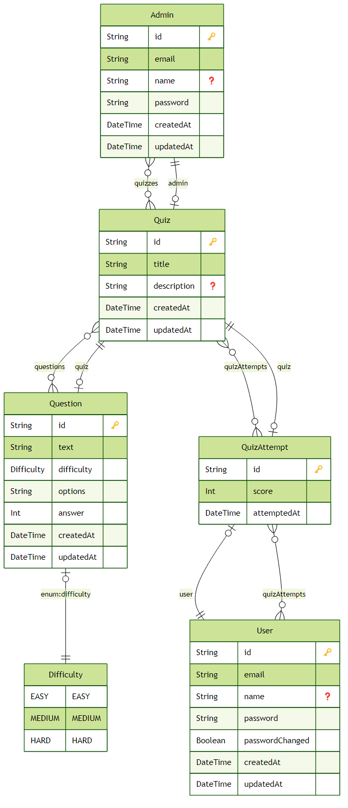

# Kuiz - Interactive Quiz Application

## Overview

Kuiz is a comprehensive quiz application designed to facilitate interactive learning and assessment. The platform offers separate pathways for administrators and regular users, with robust security measures and an engaging user experience. Administrators can create and manage quizzes, while users can participate in multiple quizzes and track their performance on leaderboards.

## Features

### User Authentication & Onboarding

- **Initial User Import**: Administrators can create users manually or upload a list (CSV) with default passwords
- **Forced Password Change**: First-time login requires users to change their default password
- **Secure Session Management**: JWT-based authentication with bcrypt password hashing

### Dashboard & Navigation

- **User Dashboard**: Access to available quizzes, performance history, and leaderboards
- **Admin Panel**: Comprehensive tools for user management, quiz creation, and performance analytics

### Quiz Creation & Structure

- **Structured Quiz Format**: Each quiz contains 10 questions:
  - 5 Easy Questions
  - 3 Medium Questions
  - 2 Hard Questions
- **Question Repository**: Questions are categorized by difficulty level

### Quiz Participation & Leaderboards

- **Multiple Quiz Participation**: Users can attempt multiple quizzes
- **Individual Quiz Leaderboards**: Each quiz has its own leaderboard reflecting user scores and rankings

## Technical Architecture

### Frontend

- **Framework**: Next.js 15.3.1
- **UI Components**: Radix UI with Tailwind CSS
- **State Management**: React Hooks

### Backend

- **Framework**: NestJS 11.0.1
- **Authentication**: JWT with role-based access control
- **API**: RESTful endpoints for quiz management and user interactions

### Database

- **Database**: PostgreSQL
- **ORM**: Prisma 6.7.0
- **Schema**:
  - User Table: Stores user credentials and login status
  - Admin Table: Manages administrator accounts
  - Quiz Table: Contains quiz metadata
  - Question Table: Stores individual questions with difficulty levels
  - QuizAttempt Table: Logs user attempts and scores for leaderboard computation

## Entity Relationship Diagram



## Installation

### Prerequisites

- Node.js (v18 or higher)
- PostgreSQL
- pnpm

### Backend Setup

```bash
# Navigate to backend directory
cd kuiz-be

# Install dependencies
pnpm install

# Set up environment variables
cp .env.local .env

# Run database migrations
pnpm prisma migrate dev

# Start the development server
pnpm start:dev
```

### Frontend Setup

```bash
# Navigate to frontend directory
cd kuiz-fe

# Install dependencies
pnpm install

# Set up environment variables
cp .env.local .env

# Start the development server
pnpm dev
```

## User Flows

### Admin Flow

1. Admin logs in
2. Accesses dashboard to add/upload users (with default passwords)
3. Navigates to quiz creation module
4. Creates a quiz by selecting/creating questions with appropriate difficulty levels
5. Publishes the quiz and monitors leaderboard data

### User Flow

1. User logs in using default password
2. System forces password change
3. User is redirected to dashboard
4. User selects and completes quizzes
5. User views their ranking on quiz-specific leaderboards

## Security Practices

- Secure password storage using bcrypt
- Role-based access control for admin panel
- JWT token validation for authenticated requests

## Additional Considerations

### User Experience

- Streamlined password change process
- Intuitive quiz interface
- Responsive design for all device sizes

### Performance

- Optimized query performance for leaderboard calculations
